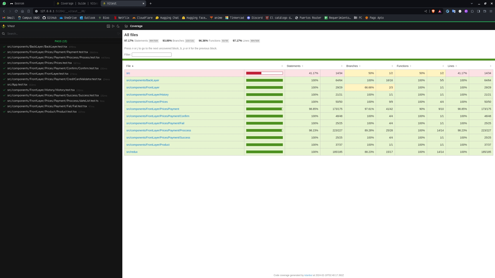
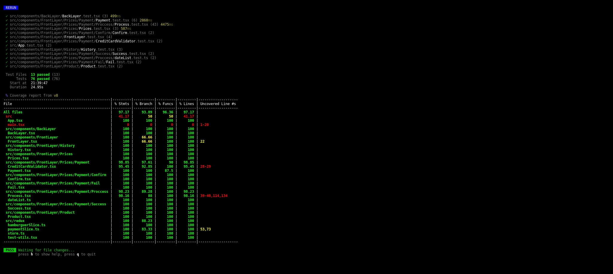

# Beenom

## Description

Fronted app (a mini store for buy pills of bee venom) building with [React](https://github.com/facebook/react), [Redux Toolkit](https://github.com/reduxjs/redux-toolkit) and [Vitest](https://github.com/vitest-dev/vitest). This app is currently running on https://main.duti2yym2fsml.amplifyapp.com/

## Installation

```bash
$ npm install
```

## Run the app

```bash
# development
$ npm run dev

# build
$ npm run build

# preview
$ npm run preview
```

## Test the app

This app is replacing jest with vitest because compatibility toolkits permit work better with vite, and the sintaxis and logic of both are ver similar

```bash
# test
$ npm run test
```

### Coverage

The result of coverage of the test based on the v8 coverage tool is:

- Using Vitest UI:


- Using V8 Terminal:
